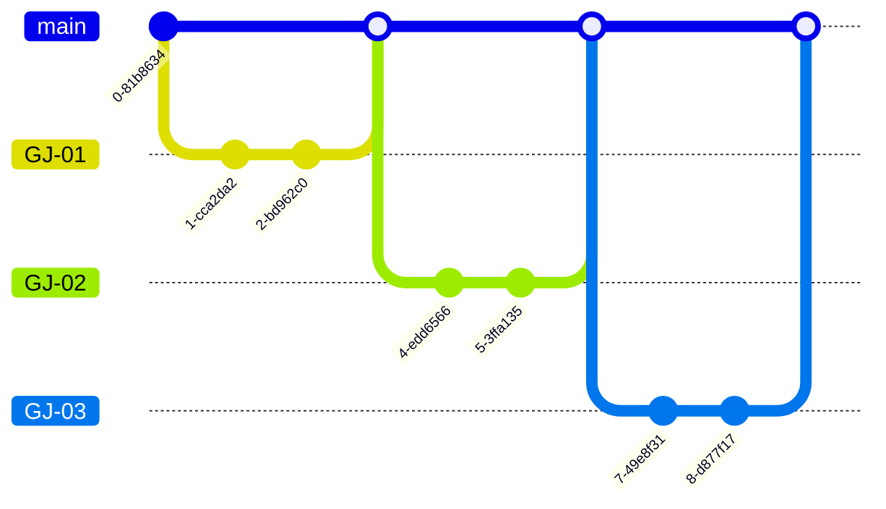

# goaljalal-backend

### GitFlow

> Describes JIRA-based gitflow

1. Create a JIRA ticket before you start working.

2. One ticket should preferably be a single commit.

3. Keep the commit graph as simple as possible.

4. Don't change the revision history of branches you share with each other.

5. Make sure to get reviews from reviewers.
6. merge your own pull requests.

